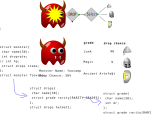
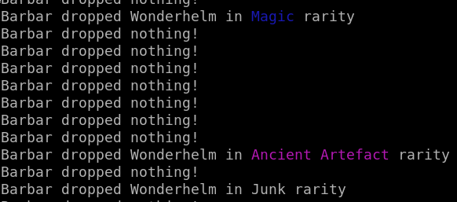

How to Code Monster Loot Drops

This guide is intended to get the Idea of random drops
and introduction in random distribution or weighted distribution.

[Check out the prototype](https://ideone.com/uWk6Tz)  

  

  

The code is developed in several steps.

Useful links:  
[SDL2](https://www.libsdl.org/) [SDL-Discourse](https://discourse.libsdl.org) [More Example Code](https://gist.github.com/Acry/baa861b8e370c6eddbb18519c487d9d8)

Assets:  
https://openclipart.org  

[Get in touch on SDL-Discourse](https://discourse.libsdl.org/u/Acry/summary)
